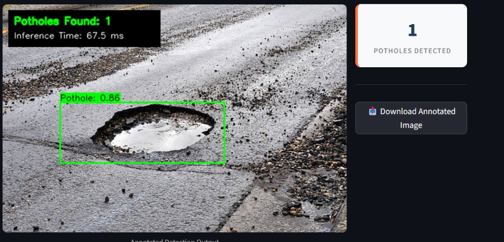
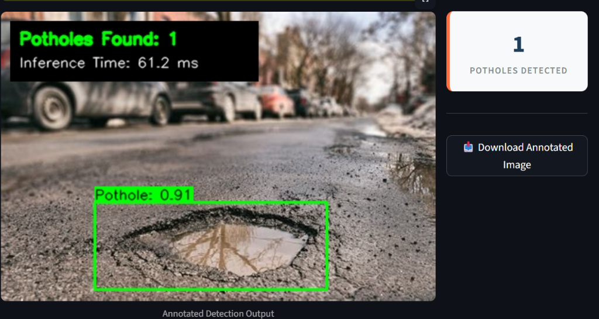

# 🕳️ Pothole Detection using YOLOv8

## Description
AI-powered pothole detection system that identifies potholes in road images using YOLOv8 object detection. It is built as a complete, self-contained Python machine learning pipeline that includes environment validation, automatic synthetic dataset generation, model training, and multi-format inference.

---

## Features
- **Environment Setup Check**: Checks Python version, PyTorch installation, CUDA/GPU availability, and package imports.
- **Synthetic Dataset Generation**: Creates a high-fidelity synthetic road dataset (300 images with lanes and rough-edged potholes) split into Train/Val/Test directories, along with auto-validation of YOLO labels.
- **Model Training**: Loads YOLOv8 Nano (`yolov8n.pt`) and trains on CPU or GPU with full training duration tracking and loss curves.
- **Multi-Format Detection System**: Supports detection on a single image, real-time video processing with FPS tracking, and batch directory processing. Includes automated generation of test media out-of-the-box.

---

## Installation
Ensure you have Python 3.8+ installed, then install all requirements:
```bash
pip install -r requirements.txt
```

---

## Setup
Initialize the directory structure and run system configuration checks:
```bash
python src/setup.py
```

---

## Prepare Dataset
Clean directories, generate the synthetic dataset, split it (70% train, 20% val, 10% test), create the YAML file, and validate YOLO annotations:
```bash
python src/prepare_dataset.py
```

---

## Train Model
Fine-tune the YOLOv8 model using transfer learning (configured for CPU-friendliness: 10 epochs at 320x320 resolution):
```bash
python src/train.py
```

---

## Detect Potholes
Run inference on a single image, a test folder, and a simulated video sequence:
```bash
python src/detect.py
```

---

## Web Application (Dashboard)
Run the interactive web dashboard to upload and detect potholes on custom images/videos:
```bash
streamlit run app/streamlit_app.py
```
This will launch the app in your default browser at `http://localhost:8502/`.

### Dashboard Previews
| Pothole Detection with Water Reflection | Street Pothole Detection |
|:---:|:---:|
|  |  |

---

## Project Structure
```text
pothole_detection/
├── dataset/
│   ├── images/
│   │   ├── train/
│   │   ├── val/
│   │   └── test/
│   └── labels/
│       ├── train/
│       ├── val/
│       └── test/
│   └── data.yaml
├── models/
│   └── yolov8/
│       ├── weights/
│       │   ├── best.pt
│       │   └── last.pt
│       └── results/
│           └── training_curves.png
├── src/
│   ├── setup.py
│   ├── prepare_dataset.py
│   ├── train.py
│   └── detect.py
├── results/
│   └── detections/
│       ├── det_test_image.jpg
│       ├── det_road_video.mp4
│       └── det_road_0271.jpg (to det_road_0300.jpg)
├── requirements.txt
└── README.md
```

---

## Results

### 📈 Training Results
- **Training Duration**: 7 minutes 6 seconds (on CPU)
- **Final Training Loss**: 1.7683
- **Final Validation Loss**: 1.7369
- **Best mAP@0.5**: 0.9948
- **Saved Weights**: `models/yolov8/weights/best.pt`
- **Saved Metrics Plot**: `models/yolov8/results/training_curves.png`

### 🔍 Detection Results (Test Set)
- **Processed Images**: 30 images
- **Total Potholes Found**: 100
- **Average Potholes/Image**: 3.33
- **Average Inference Latency**: 101.9 ms per image (CPU)
- **Video Output**: 90 frames processed at 8.5 FPS, saved to `results/detections/det_road_video.mp4`
