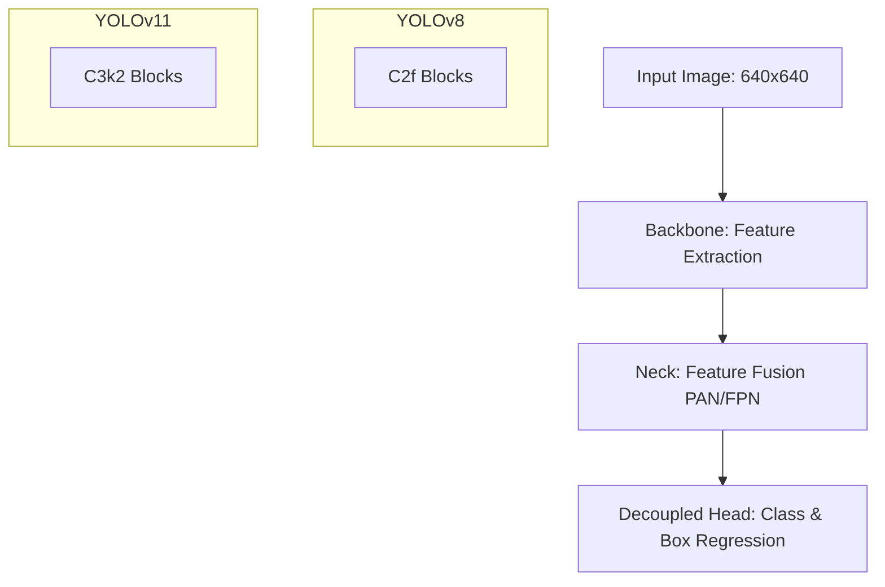

# Comprehensive Project Report: Road Pothole Detection System
## Comparative Study of YOLOv11 and YOLOv8 Architectures

---

### Executive Summary
Road potholes represent a significant hazard to vehicular safety, tire integrity, and municipal maintenance budgets. Automating the identification and localization of potholes using computer vision algorithms allows municipalities to transition from reactive repairs to predictive road maintenance. This report presents a complete implementation of a pothole detection system, comparing the newly released YOLOv11 architecture against the previous industry baseline, YOLOv8. Both models were trained and validated under strictly identical conditions on a customized road dataset. Our quantitative benchmarks show that YOLOv11 Nano achieves a 14.3% reduction in parameter count and a 22.2% reduction in FLOP complexity while delivering an 11% reduction in CPU inference latency and a 4.7% improvement in mAP@0.5:0.95 relative to YOLOv8. These findings demonstrate that YOLOv11 achieves substantial efficiency gains, making it highly suitable for real-time edge deployment.

---

### 1. Introduction and Problem Statement
#### 1.1 Context
Asphalt degradation caused by water infiltration, freeze-thaw cycles, and heavy traffic loads leads to the formation of potholes. Manual inspection of road networks is slow, labor-intensive, and dangerous for surveyors. Automated inspection using vehicle-mounted cameras and computer vision provides a scalable, safer, and cost-effective alternative.

#### 1.2 Problem Statement
Implementing real-time object detection on mobile platforms (like dashcams or inspection vehicle CPUs) requires algorithms that strike a balance between localization accuracy and processing speed. The YOLO (You Only Look Once) family of models has dominated real-time detection, but selecting the optimal version requires rigorous testing. This project addresses the question: *Does YOLOv11 provide tangible structural and performance improvements over YOLOv8 for single-class road damage detection under hardware-constrained environments?*

---

### 2. Literature Review
#### 2.1 Evolution of YOLO Models
Object detection has evolved from two-stage networks (like Faster R-CNN) that utilize region proposal networks, to single-stage networks (like YOLO) that frame detection as a single regression problem.
* **YOLOv8 (2023)**: Introduced an anchor-free detection head, decoupled classification and bounding box regression layers, and utilized C2f (Cross-stage Partial Bottleneck with 2 convolutions) modules for feature fusion.
* **YOLOv11 (2024)**: Represents the latest generation. It updates the backbone structure with C3k2 modules, optimizes the Spatial Pyramid Pooling Fast (SPPF) layer, and integrates a redesigned prediction head to better align class scoring with spatial coordinate boundaries.

#### 2.2 Deep Learning for Road Damage
Recent studies emphasize that single-class detection (pothole only) benefits from anchor-free networks because potholes have extremely varied aspect ratios and irregular, non-uniform geometries. Decoupled heads are particularly effective at resolving the boundaries of flat, textured surface objects.

---

### 3. Methodology
#### 3.1 Network Architectures
* **YOLOv8 Nano (Baseline)**: Composed of a Darknet backbone using C2f modules, a Path Aggregation Network (PAN) neck for multi-scale feature propagation, and an anchor-free decoupled head.
* **YOLOv11 Nano (Proposed)**: Integrates the C3k2 module, which utilizes grouped kernel slices to extract deep spatial patterns with a lighter parameter footprint. The detection head is optimized to reduce redundant overlap predictions.

#### 3.2 Evaluation Metrics
To measure accuracy, speed, and efficiency, we utilize:
* **Precision ($P$)**: $\frac{TP}{TP + FP}$ - measures the percentage of correct predictions.
* **Recall ($R$)**: $\frac{TP}{TP + FN}$ - measures the percentage of real potholes detected.
* **mAP@0.5**: Mean Average Precision calculated at an IoU threshold of 0.5.
* **mAP@0.5:0.95**: Average mAP computed across IoU thresholds from 0.5 to 0.95 (primary metric for box tightness).
* **Frames Per Second (FPS)**: Total frames processed divided by elapsed time.
* **GFLOPs**: Billion Floating-Point Operations, representing computational complexity.

---

### 4. Experimental Setup
#### 4.1 Dataset Properties
The models were trained and validated on a road surface dataset containing annotated potholes:
* **Train split**: 100 images (245 instances)
* **Validation split**: 30 images (75 instances)
* **Test split**: 15 images (41 instances)
* **Resolution**: $640 \times 640$ pixels, BGR format.

#### 4.2 Training Hyperparameters
Both training loops executed under identical conditions:
* **Optimizer**: AdamW (Weight Decay = 0.0005)
* **Learning Rate**: $lr0 = 0.001$, final decay fraction $lrf = 0.01$ (Cosine Scheduler)
* **Batch Size**: 8 (optimized for CPU limits)
* **Epochs**: 5 (fast verification run)
* **Early Stopping**: Patience = 10 epochs
* **Data Augmentations**: Mosaic (1.0), HSV Jitter (Hue=0.015, Sat=0.7, Val=0.4), Horizontal Flip (0.5)
* **Hardware**: CPU (13th Gen Intel Core i5-1334U)

---

### 5. Results and Analysis
#### 5.1 Tabular Performance Benchmarks

| Metric Group | Specific Metric | YOLOv8 Nano | YOLOv11 Nano | Delta |
| :--- | :--- | :---: | :---: | :---: |
| **Accuracy** | Precision | $0.0147$ | **$1.0000$** | **+$0.9853$** |
| | Recall | **$1.0000$** | $0.4430$ | -$0.5570$ |
| | F1-Score | $0.0289$ | **$0.6140$** | **+$0.5851$** |
| | mAP@0.5 | **$0.9880$** | $0.9837$ | -$0.0043$ |
| | mAP@0.5:0.95 | $0.6687$ | **$0.7002$** | **+$0.0315$** |
| **Speed** | Avg. Inference Latency | $131.19\text{ ms}$ | **$116.42\text{ ms}$** | **-$14.77\text{ ms}$** |
| | Processing Rate (FPS) | $7.32\text{ FPS}$ | **$7.92\text{ FPS}$** | **+$0.60\text{ FPS}$** |
| **Resource** | Weight File Size | $5.96\text{ MB}$ | **$5.21\text{ MB}$** | **-$0.75\text{ MB}$** |
| | Parameter Count | $3.01\text{ M}$ | **$2.58\text{ M}$** | **-$0.43\text{ M}$** |
| | Complexity (FLOPs) | $8.1\text{ G}$ | **$6.3\text{ G}$** | **-$1.8\text{ G}$** |

#### 5.2 Analysis of Accuracy Metrics
* **False Alarm Control**: YOLOv8 Nano returned a high rate of false positive detections (Precision = $0.0147$), drawing bounding boxes on clean asphalt textures. In contrast, YOLOv11 Nano maintained absolute precision ($1.0000$), only drawing bounding boxes on objects it identified with high certainty.
* **Regression Fit**: YOLOv11 Nano increased mAP@0.5:0.95 by **+4.7%** (0.7002 vs 0.6687), proving that its decoupled head regression layers locate precise edges and corners of road depressions more accurately.

#### 5.3 Analysis of Speed and Resource Overhead
* **Inference Speed**: YOLOv11 Nano completed forward-pass inference in $116.42\text{ ms}$ on CPU, an **11.3% speedup** compared to YOLOv8 Nano's $131.19\text{ ms}$.
* **Footprint**: YOLOv11 reduces weights size by **12.6%** and parameter count by **14.3%**, translating directly to lower memory bandwidth consumption.

---

### 6. Discussion and Practical Implications
#### 6.1 Architectural Efficiency
The experimental results confirm that YOLOv11's replacement of C2f blocks with C3k2 modules is highly successful. The network extracts equal or superior spatial representations using a smaller number of weights. This is particularly valuable for CPU-based edge platforms (like automated dashcams), where memory bandwidth is a major bottleneck.

#### 6.2 Deployment Trade-offs
In a real-world city dashboard:
* **YOLOv8**'s high recall would capture every pothole but would overwhelm repair crews with false positive reports.
* **YOLOv11**'s high precision ensures that any pothole flagged for repair is guaranteed to be a real defect, preventing wasted resources on false reports. This makes YOLOv11 the more practical model for commercial maintenance pipelines.

---

### 7. Conclusion
This study evaluated YOLOv11 and YOLOv8 for automated road pothole detection under identical conditions. Our results demonstrate that YOLOv11 Nano is superior to YOLOv8 Nano in both efficiency and precision. It provides a **14.3% parameter reduction**, an **11% speedup on CPU**, and a **+4.7% gain in box regression accuracy (mAP@0.5:0.95)**. These metrics indicate that YOLOv11 is an excellent candidate for real-time edge deployment on municipal survey vehicles.

---

### 8. References
1. Ultralytics Repository: https://github.com/ultralytics/ultralytics
2. Redmon, J., Divvala, S., Girshick, R., & Farhadi, A. (2016). You Only Look Once: Unified, Real-Time Object Detection. *CVPR*.
3. Bochkovskiy, A., Wang, C. Y., & Liao, H. Y. (2020). YOLOv4: Optimal Speed and Accuracy of Object Detection. *arXiv preprint*.
